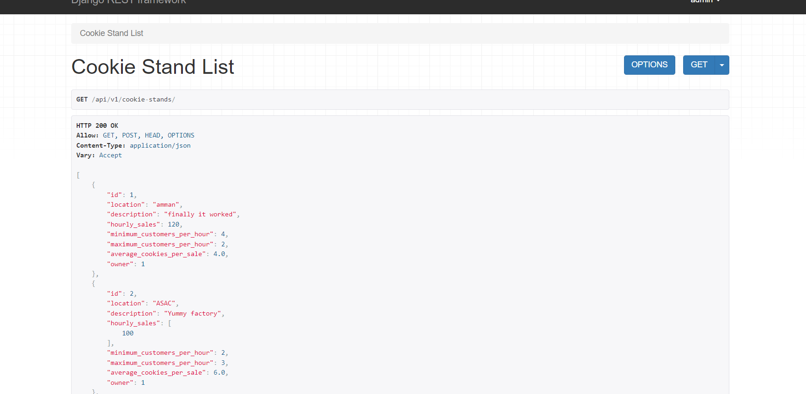

# **Lab: 34 - Back End Deployment**

## **Customization Steps**

1. create repo from template

# **Lab: 34 - Back End Deployment**


## **Customization Steps**

1. create repo from template

2. git clone on local machine

3. run ```poetry shell```

4. i need to install all the requirements
    ```poetry export -f requirements.txt --output requirements.txt```

5. upgrade pip
	```pip install --upgrade pip```

6. do the proper changes to the repo to match your own app and project


7. go to .env.sample, change its name to .env


8. create a database on elephantSQL


9. go to dockerfile and docker-compose to fix the python version


10. install psycopg2
	```poetry add psycopg2-binary```

11. since i added something new, update the requirments.txt


12. run ```python manage.py migrate```-------> this will connect us into a remote database


13. ```python manage.py createsuperuser --user admin --email admin@admin.com```


14. go to ElephantSQL, click on browser inside your database

    from table queries, pick the first option:

    ```
        SELECT * FROM "public"."accounts_customuser" LIMIT 100
        and click on execute

    ```


15. to create an app on heroku, run:

	```heroku apps:create cookie-stand```

	now the app is created on heroku dashboard


16. if i run this command on the terminal:

    ```git remote -v```


17. now go to "heroku.yml"


18. we need to tell heroku that we're using a docker container, by running this command:

    ```heroku stack:set container```


19. ```git status```

    ```git add .```

    ```git commit -m ""```


	now push to heroku:	```git push heroku main```


20. after its done deplying everything on heroku and done creating a container
go to heroku and click on the deplyment --> settings --> Config Vars
and add the values from .env file


21. add

	```
    CSRF_TRUSTED_ORIGINS = tuple(env.list("CSRF_TRUSTED_ORIGINS"))
    ```

    to settings.py


22. add .env
	```
    CSRF_TRUSTED_ORIGINS='https://cookie-standss.herokuapp.com'
    ```


23. add to .env
    ```
    cookie-standss.herokuapp.com to the ALLOWED_HOSTS
    ```

24. add to env = environ.Env(  inside settings.py
    ```
       CSRF_TRUSTED_ORIGINS = (list, []),
    ```
<br>

## **Picture of deployment**



